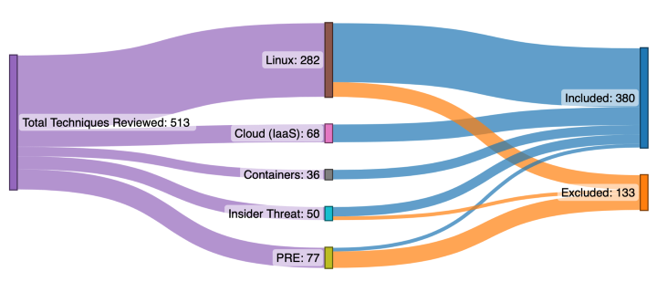
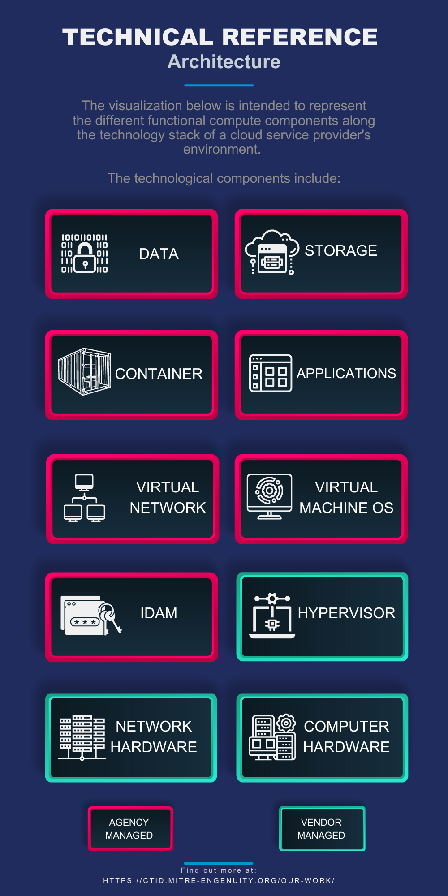
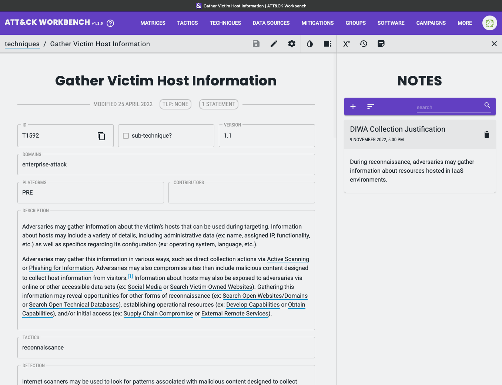
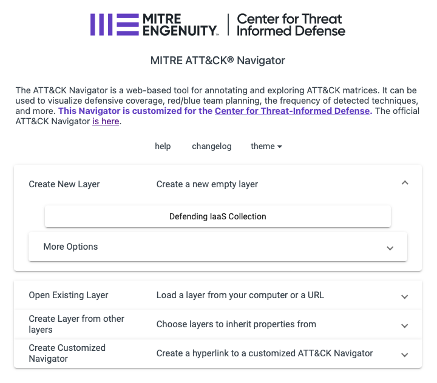
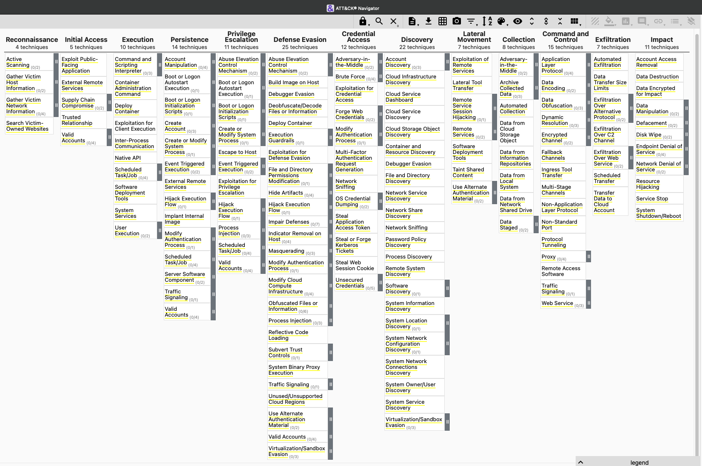

Collection
==========

The Defending IaaS collection contains 277 ATT&CK techniques selected according
to our documented :doc:`methodology <methodology>`. It does not include
techniques from any sources other than ATT&CK.

  The Defending IaaS collection pulls together multiple ATT&CK matrices and
  then selects those techniques that are applicable to our architecture.

.. note::

  The threat model that results from this process does not provide a risk
  determination, i.e. the likelihood of successful attack or the resulting
  impact. The methodology does not provide a scoring rubric to evaluate an
  organization’s current security controls and their effectiveness. The
  adversarial behavior modeled in the collection may be used to support these
  and other use cases.

Architecture
------------

  Click to enlarge.

This project adopts the definition of cloud computing as formalized in the
National Institute for Standards and Technology (NIST) SP 800-145:

    Consumers have the capability to provision computing resources to deploy and
    run environments and applications. Cloud providers manage the underlying
    infrastructure while the consumers have control over the computing
    resources, including some control of selected networking components…

This separation of responsibilities is a focal point for the Defending IaaS
collection. The collection includes ATT&CK techniques that pertain to the
"Customer Managed" components seen in the architecture diagram to the right.

This architecture and division of responsibility are tailored to the Defending
IaaS project and its chosen attack surface, but in general the methodology can
be applied to any architecture or IaaS vendor.

Building the Collection
-----------------------

You can extend the Defending IaaS collection or build your own using `ATT&CK
Workbench
<https://github.com/center-for-threat-informed-defense/attack-workbench-frontend>`__.
As part of this project, we updated Workbench to make the creation and sharing
of collections easier than ever.

  Editing a collection in ATT&CK Workbench is easier than ever.

For more information on building collections in Workbench, refer to the
`Workbench documentation
<https://github.com/center-for-threat-informed-defense/attack-workbench-frontend/blob/master/docs/collections.md>`__.

Visualize the Collection
------------------------

There are several ways to access the Defending IaaS collection. The easiest way
is to load it as a base layer in ATT&CK Navigator:

  Intialize a Navigator layer with the Defending IaaS collection.

1. Go to our `customized ATT&CK Navigator
   <https://center-for-threat-informed-defense.github.io/attack-navigator/>`__.
2. Select "Create New Layer" and then click "Defending IaaS Collection".

This will intialize a new ATT&CK Navigator layer containing all of the techniques
from the Defending IaaS collection.

  Visualizing the Defending IaaS collection as a Navigator layer. (Click to
  enlarge.)

ATT&CK Navigator is a powerful tool for visualizing and annotating an ATT&CK
matrix or collection. You can use it to visualize security control coverage,
red/blue team planning, or risk assessments. Navigator supports color coding of
techniques and assigning numeric scores. It offers a variety of ways to
visualize and export content in support of the Defending IaaS use cases.

Download the Collection
-----------------------

You can also `download the collection
<https://github.com/center-for-threat-informed-defense/defending-iaas-with-attack/tree/main/data>`__
in machine-readable format (STIX JSON) or Excel spreadsheet for use in other
tools or if you want to write custom software to process the collection.
