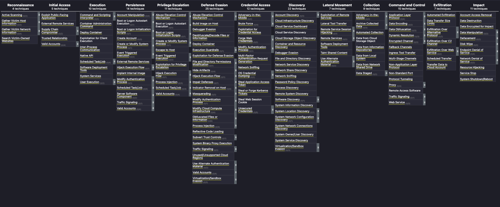

Getting Started
===============

`Navigator <https://center-for-threat-informed-defense.github.io/attack-navigator/>`_
---------
ATT&CK Navigator is designed to provide basic navigation and annotation of
ATT&CK matrices. It can be used to visualize defensive coverage, red/blue team
planning, and assist in security assessment and engineering. Navigator can be
used on the Enterprise, Mobile, or ICS ATT&CK technology domain knowledge bases,
and in this cae, combinations of those elements. Navigator allows color coding,
numerical values, and other cell formatting in the matrix. With filters and a
creation of new views, there are variety of ways to display tactics and
techniques and their importance. The utility of Navigator is key to visualizing
and accomplishing related use cases for the collection of IaaS techniques.

`Workbench <https://github.com/center-for-threat-informed-defense/attack-workbench-frontend>`_
---------
ATT&CK Workbench is a tool to explore, create, annotate, and share extensions of
a local version of ATT&CK – drastically reducing the barriers for defenders to
ensure that their threat intelligence is aligned with the public ATT&CK
knowledge base. The utility of Workbench to create collections of techniques
comprised of new objects or existing objects with new content is at the core of
this methodology.

.. note::
    Collections are sets of related ATT&CK objects, and may be used to represent specific releases of a dataset such as “Enterprise ATT&CK v12.0” or any other set of objects one may want to share with someone else.

.. figure:: _static/workbench_t1592_screenshot.png
   :alt: Screenshot of Workbench with notes for T1592.
   :align: center
   :scale: 50%

`MITRE ATT&CK <https://attack.mitre.org/>`_
------------
ATT&CK® is a globally accessible knowledge base of adversary tactics and
techniques based on real-world observations. The ATT&CK knowledge base
represents adversary goals as tactics and the specific behaviors to achieve
those goals (how) as techniques and sub-techniques. This methodology leverages
the information in the knowledge base and its underlying data model to add and
modify collections of techniques across technology domains and platforms.

Getting Involved
----------------

There are several ways that you can get involved with this project and help
advance threat-informed defense:

    + Review the collection using ATT&CK Navigator or ATT&CK Workbench.
      Navigator is the easiest way to get started, using the resource link
      above. If you are already a Workbench user, you will find that the latest
      version includes new capabilities that are helpful for creating custom
      collections.
    + Read the methodology. The Defending IaaS collection is helpful in its own
      right, but the methodology is provided so that organizations can create
      tailored collections to meet their own needs.
    + Build and share your own collections! This project provides the
      methodology and tools needed to build collections tailored to any need.
      You can build proprietary collections to use within your organization, or
      you can publish collections to benefit the community.

