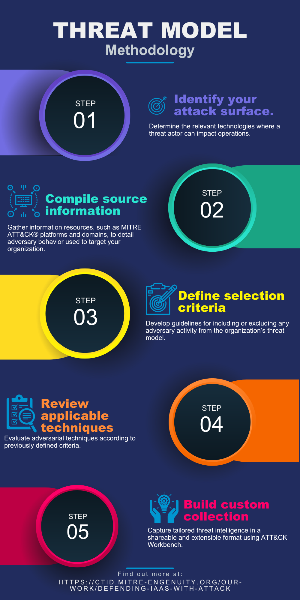

Methodology
===========

The Defending IaaS with ATT&CK project developed a methodology to identify and
select techniques across multiple ATT&CK matrices that align to the project's
defined attack surface. We are sharing this approach with the community
so that you can build and share your own collections of techniques that are
tailored to any architecture for a comprehensive and unique view ofadversary 
behavior.

Identify Attack Surface
-----------------------

  Click to enlarge.

The first step is to identify the attack surface. This includes the system
components that are in scope, the range of technologies comprising the system,
and the user archetypes involved in the system. Delineate the security boundary,
especially in vendor scenarios where responsibilties may be shared with or
delegated to a partner organization.

In the Defending IaaS collection, the attack surface is defined as the
application containers, virtual machines, or the cloud management layer.
The user roles include various levels of permissions, from end users to trusted
insiders to external adversaries.

Compile Sources
---------------

The second step is to identify and import sets of ATT&CK techniques from the
relevant `ATT&CK matrices <https://attack.mitre.org/matrices/>`__. The
techniques in scope for the Defending IaaS collection are spread across several
matrices:

* `Linux Matrix <https://attack.mitre.org/matrices/enterprise/linux/>`__
* `Cloud (IaaS) Matrix <https://attack.mitre.org/matrices/enterprise/cloud/iaas/>`__
* `Containers Matrix <https://attack.mitre.org/matrices/enterprise/containers/>`__
* `PRE Matrix <https://attack.mitre.org/matrices/enterprise/pre/>`__
* The Center for Threat-Informed Defense `Insider Threat TTP KB <https://github.com/center-for-threat-informed-defense/insider-threat-ttp-kb>`__

The Cloud and Container matrices in ATT&CK for Enterprise describe adversary
techniques at the cloud management and container technology layers, but do not
include techniques that apply to the system being hosted. This is why multiple
sources are consulted: to create a broad overlay of all the techniques that are
relevant to our target architecture.

The techniques from all of these sources are combined together to form a list of
candidates for the collection, but some of these techniques will not apply to
the specific architecture targeted by this project. The next step develops the
criteria to determine which candidate techniques are downselected into the final
collection.

Define Criteria
---------------

The third step is to define criteria that can be applied to the candidate
techniques in order to select the techniques that pertain to the target
architecture. Criteria can vary from specific to more general, have both
inclusive and exclusive rules, and will be driven by the source data. The
goal of the selection criteria should offer clear guidance in refining the
list of techniques from the compiled domains and platforms, while avoiding 
being overly burdensome in reviewing every technique in depth. When reviewing 
the techniques, additional criteria may be added later.

While the Linux platform captures all techniques that can be used on Linux
systems, not all are applicable to our target architecture (Linux virtual
machines and containers running on an IaaS platform). For example, `T1113 -
Screen Capture <https://attack.mitre.org/techniques/T1113/>`__ does not apply to
a headless container or virtual machine. Alternatively `T1542.001 - Pre-OS Boot:
System Firmware <https://attack.mitre.org/techniques/T1542/001/>`__ may apply to
in a technical sense--i.e. the machine does have firmware--but the firmware is
either hidden by the IaaS abstraction and/or it is the responsibility of the
IaaS vendor.

For Defending Iaas, the criteria focus on three key areas:

1. **Physical criteria select techniques based on physical characteristics of
   the system.** Techniques in this section would exclude attacks that target
   the underlying physical technology.

   a. Exclude techniques that rely on physical access or that target hardware:
      physical servers, firmware, hypervisor, and networking hardware.
   b. Exclude techniques that target the IaaS vendor-managed components, such
      as physical security, storage, servers, and virtualization.

2. **Operational criteria select techniques based on how the system is intended
   to operate.** There are numerous definitions of cloud service models.
   Examples of these technology components include operating system (Linux),
   applications, networking, authentication and access management services.

   a. Exclude techniques specific to workstations, end-users, Virtual Desktop
      Infrastructure (VDI), or similar workspace-as-a-service offerings.
   b. Exclude operating system services and components that manage hardware or
      system components.
   c. Exclude applications and extensions that are typically associated with
      workstation or end-user systems, such as email clients and web browser.
   d. Include 3rd party applications and runtimes if they are present in the
      environment, for example SQL server or Java.
   e. Include tools provided by the IaaS vendor or 3rd parties to build and
      orchestrate cloud systems.

3. **Environmental criteria select techniques based on the environment in which
   the system runs.** This section addresses nuances of adversary behavior that
   may vary, depending on the environment’s technology deployment or operations.

   a. Exclude techniques that do not align with common best practices for
      IaaS, such as automated provisioning, scaling, and data recovery.
   b. Exclude techniques that require end-user interaction.

Select Techniques
-----------------

The fourth step is applying the criteria to determine which techniques to
include in the collection. During this process, we recommend adding notes or
comments to explain the rationale behind the inclusion or exclusion of each
technique. These annotations are helpful later for extending, modifying, or
updating the collection when the underlying architecture changes. The rationale
for each technique can also clarify ambiguities in the process.

Build Collection
----------------

The final step is to assemble the techniques into a collection (e.g. inside of
ATT&CK Workbench) and export the collection as a machine-readable STIX bundle in
order to share without your organization or externally. The STIX bundle can be
loaded into ATT&CK Navigator for visualization or processed using other
STIX-compatible tools.
