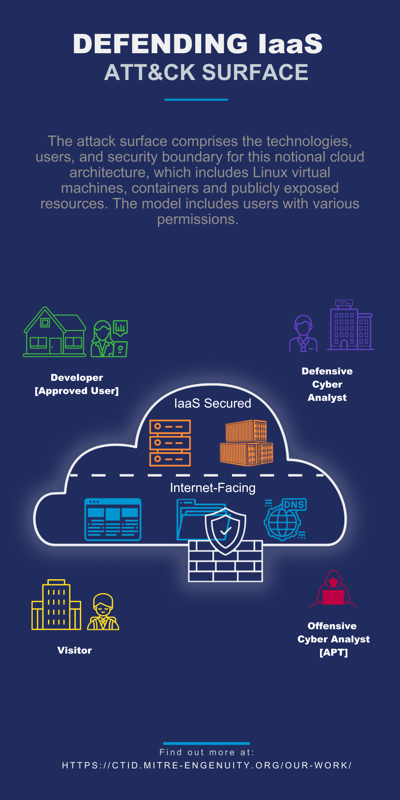

Overview
========
..
  Whenever you update overview.rst, also look at README.md and consider whether
  you should make a corresponding update there.

.. epigraph::

    “If you know the enemy and know yourself, you need not fear the result of a hundred battles. If you know yourself but not the enemy, for every victory gained you will also suffer a defeat. If you know neither the enemy nor yourself, you will succumb in every battle.”

    -Sun Tzu

Introduction
------------
Defending IAAS with ATT&CK delivers an approach to build custom threat collection objects that reflect adversary behaviors in modern cloud environments.

Organizations using Infrastructure as a Service (IaaS) need to understand the
techniques adversaries can use against them whether they occur at the cloud
management layer, the container technology, or on hosted infrastructure.
Organizations seeking a holistic view of adversary activities against IaaS would
need to combine techniques across Linux, Cloud (IaaS), and Containers, examining
each technique for relevancy to their environment.

Adapting the process outlined in the Cyber Threat Model Methodology, the
Defending IaaS with ATT&CK® Project developed a methodology to identify and
select techniques across multiple platforms that align to the IaaS attack
surface. The procedure provides the community a straightforward and tailorable
approach to identify, build, and share collections of techniques to provide a
comprehensive view of adversary behavior.

The Defending IaaS with ATT&CK methodology defines the attack surface, specifies
platforms to include from the ATT&CK knowledge base, selects criteria to
determine applicable techniques, builds the combined set of techniques into a
collection, and visualizes the results into a matrix to interactively navigate
techniques and create custom views using layers. The resulting collection of
techniques can be extended to detect and mitigate adversarial activity.

..
    <!--Insert attack surface image here from infographic-->

Use Cases
---------
DIWA is designed to support the following use cases:

        + Passive Cyber Table Top Testing, Adversary Emulation Planning, and Pen
          Testing.
        + Expand Threat Collection to Security Stack Mappings for your CSP
          (Azure, AWS , Google Cloud) for protect, detect, and response.
        + End-to-End Threat Model –How this can be applied for multi-cloud
          interoperable architectures (e.g., employee’s mobile device
          (android/IoS), employee’s Windows/MacOS to organization’s leased CSP’s
          IaaS and/or privately hosted on premise infrastructure).

Scope
-----
This methodology does not include adding or extending other sources of CTI into
the ATT&CK knowledge base. The resulting threat model from this process does not
provide a risk determination, such as the likelihood that attack my occur and
the resulting impact. The methodology does not provide a scoring rubric to
evaluate an organization’s current security controls and their effectiveness –
the adversarial behavior modeled in the collection may be used to support these
and other use cases.

.. Important::
  "CISA's Cloud Security Technical Reference Architecture report referenced uses the National Institute for Standards and Technology Special Publication 800-145: The NIST Definition of Cloud Computing as:“Consumers have the capability to provision computing resources to deploy and run environments and applications. Cloud providers manage the underlying infrastructure while the consumers have control over the computing resources, including some control of selected networking components…”

.. figure:: _static/reference_architecture.png
   :alt: Visually depicts reference architecture components.
   :align: center
   :width: 400

Get Involved
------------
There are several ways that you can get involved with this project and help
advance threat-informed defense. Send your feedback to ctid@mitre-engenuity.org
or post on `GitHub issues
<https://github.com/center-for-threat-informed-defense/defending-iaas-with-attack/issues>`__.

Notice
------
© 2022 MITRE Engenuity. Approved for public release. Document number CT0059.

Licensed under the Apache License, Version 2.0 (the "License"); you may not use
this file except in compliance with the License. You may obtain a copy of the
License at http://www.apache.org/licenses/LICENSE-2.0

Unless required by applicable law or agreed to in writing, software distributed
under the License is distributed on an "AS IS" BASIS, WITHOUT WARRANTIES OR
CONDITIONS OF ANY KIND, either express or implied. See the License for the
specific language governing permissions and limitations under the License.

This project makes use of ATT&CK®: `ATT&CK Terms of Use
<https://attack.mitre.org/resources/terms-of-use/>`__
